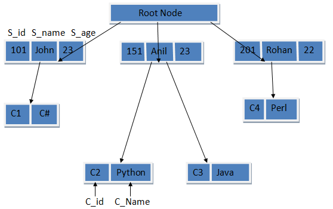

# Firebase Documentation

### What is BaaS?

- First, we need to establish what a "Back-end as a Service" is.

- A Back-end as a Service or BaaS, is a cloud computing model that one would use so that the backend portion of their app is already functional, primarily so that they can focus more on the front end part of their app.

## What is Firebase?

- Firebase is exactly that, a BaaS tool made by Google.

- Since it is made by Google, Firebase applications are quite scalable.

- Additionally, Firebase offers a selection of software development kits.

- Firebase was created to be easy to use and integrate with different frameworks.

- Specifically, I am focusing on the real-time database that Firebase offers for an application.

## How does the real-time database work?

- Firebase offers a cloud NoSQL real-time database, meaning it updates and synchronizes in real-time to every client being used by it.

- Whenever a client writes data to the database, the change happens immediately on every other connected device through WebSockets.

- WebSockets are persistent two-way connections between a database and client.

- Additionally, NoSQL, or "Not Only SQL" is a special type of SQL that allows for flexible datatypes to be stored that might not always adhere to the schema. It is a non-relational database that stores data in a non-tabular format.

## How it compares to PostGreSQL.

| Feature | Firebase Realtime Database | PostgreSQL |
|---------|----------------------------|------------|
| **Type** | NoSQL (JSON-based, hierarchical) | SQL (Relational database) |
| **Structure** | Schema-less; data stored as JSON | Structured; uses tables, rows, and relationships |
| **Querying** | Limited querying capabilities; hierarchical traversal | Powerful SQL querying, joins, and aggregations |
| **Scalability** | Designed for real-time synchronization and mobile/web apps | Scalable for complex queries and enterprise applications |
| **Transactions** | Basic transactions with limited capabilities | ACID-compliant transactions for complex operations |
| **Data Consistency** | Event-driven; eventual consistency | Strong consistency with transactional integrity |
| **Offline Support** | Built-in offline mode for mobile apps | Requires additional configuration for offline support |
| **Security** | Rules-based security model with Firebase Authentication | Fine-grained security control via roles, permissions, and encryption |
| **Use Cases** | Real-time chat, live updates, IoT | Enterprise applications, financial systems, analytics, large-scale data processing |

> - Table generated by Microsoft CoPilot.

INDEX:

> - JSON is a plain-text, human and machine readable file format is used for data interchange.

> - Hierarchical databases are essentially trees used to store data, often used in web applications.

## For what kind of projects would Firebase be used?

### Since it has a real-time database, Firebase would be great for:

- Chat apps

- Collaborative project programs, like Replit

- Live data dashboards, like trading views

- Social media apps, especially with a NoSQL database that can handle a lot of unstructured data.

