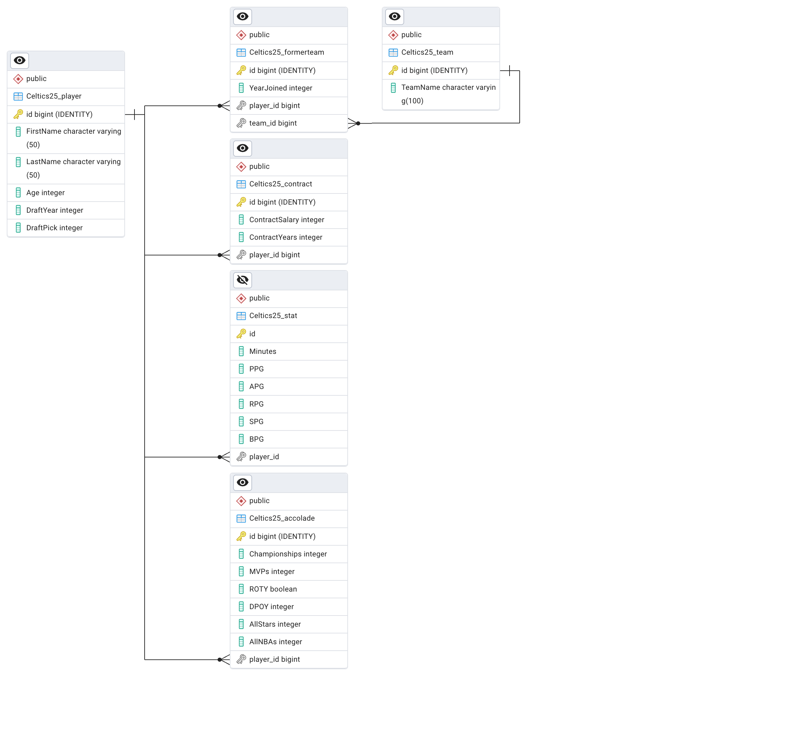

# Investiage Tables

### ER Diagram and Celtics25 SQL

> Hand-made ER

> SQL File

[Celtics25SQL](https://github.com/jackaaburk/ITE140/blob/main/Celtics25SQLProject/Celtics25SQL.sql)

> PGAdmin ER

### Reflection

1. How does the final ER diagram compare to the one you created manually? Is it exactly the same? Is there any difference that surprised you?

> 

2. How does the effort compare? If I asked you to create and document a new database, would you choose to follow the procedure that we followed in our end-of-semester project, or would you use Django?

> If I were to create and document a new database, I would most likely use Django if it was a smaller database. If it was a smaller database, it would be much easier to understand and create, allowing me to skip out on making ER diagrams at the beginning. In my opinion, using Django is a much more iterative design model. Additionally, Django easily lets you visually interpret data in your database through its admin page. I prefer these things, so I would choose Django.