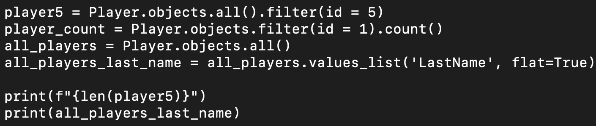
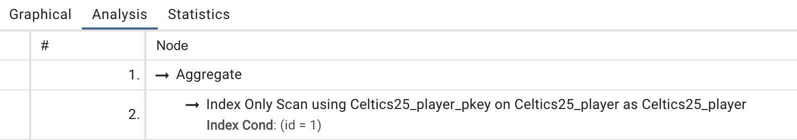
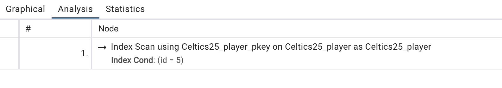
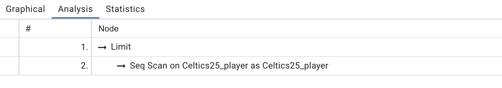

# Investigate Queries

## ORM Code

## Queries and PGAdmin Analyzes

### Index Only

> SELECT COUNT(*) AS "__count" FROM "Celtics25_player" WHERE "Celtics25_player"."id" = 1;

- Since this query is only finding a certain row using the index column IDs, and then counting them, it does not need to actually access any of the row's data, allowing it to only use the index on the scan. Normally, COUNT(*) would also work as an index only scan, but PostGres tends to use sequential scans on it unless it has a filter in place.

### Index

> SELECT "Celtics25_player"."id", "Celtics25_player"."FirstName", "Celtics25_player"."LastName", "Celtics25_player"."Age", "Celtics25_player"."DraftYear", "Celtics25_player"."DraftPick" FROM "Celtics25_player" WHERE "Celtics25_player"."id" = 5;

- Since the query first finds the row with column id 5, it uses the index first, then it takes all the data and attributes from the row. Thus, it uses both an index and the actual table to get the output making it an index scan.

### Sequential

> SELECT "Celtics25_player"."LastName" FROM "Celtics25_player" LIMIT 21;

- Since this scan takes data from every row (with a limit of 21), it doesn't use the index since it needs to retrieve data from each row anyway.