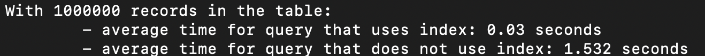
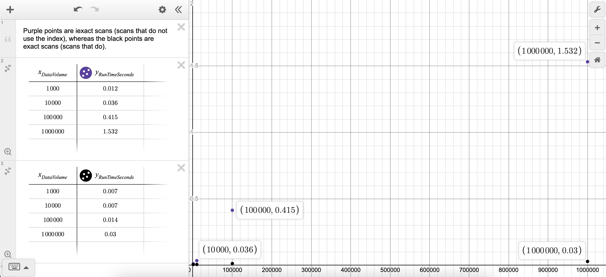

# Use the Index, Django: Documentation

## Discussion of the two indexes that Django added, and the queries that use them.

- For my project, I added an index to the FirstName varchar column, designating the players' first names.

- When I did this, Django secretly added two columns, which could be seen in PGAdmin.

- Often, Django will do this to create multiple indexes for certain cases, such as having certain constraints on a query like UNIQUE.

- Thus, one index is likely backing the constraint.

## Comparison of the query plans generated when one uses/doesn't use __iexact.

> Without __iexact

- When one doesn't use __iexact, Django is able to use the index since it isn't doing a case-insensitive search.

> With __iexact

- When one does use __iexact, Django is inable to use an index, possibly making it much slower.

> - Intuitively, index and index only scans are very heavily lengthened when using __iexact, since it instead turns into a sequential scan/bitmap, requiring the scan to go through more of the actual table/data instead of the index.

> - Note: There are no entries with the first name "john", there are only some with "John". It isn't like the iexact query is retrieving more rows or anything, it is just inefficient.

## Results of the runtime investigation, formatted into a table.

> Run times for iexact vs. exact. We can see that iexact run times increase significantly over large datasets, whereas exact run times are rather inconsiderable.

## Short summary of the takeaways of this activity. Specifically, additional warnings to Django developers who are considering using the __iexact feature in their ORM code.

> Key Takeaway/Warnings

- Only use case-insensitive searches in Django like __iexact when the scan is a sequential scan, since it searches every row anyway.
- If you do end up using case-insensitive searches with an index/index only scan, it can greatly slow the speed of the database.
- If you use the case-insensitive searches with index/index only scans, the time it takes to scan is a positive, linear line that grows relatively quickly. On the other hand, using the index with these scans takes relatively the same amount of time regardless of the data volume.
- Using inefficient queries like this could be greatly detrimental to a website/company that often access databases with user requests to the website, or any request to the database for that matter. For example, if an efficient index scan took .1 seconds, and an inefficient index scan took .5 seconds, the different may look inefficient to the naked eye, but after multiple reqeusts for example, say 20, that is a difference between 2 and 10 seconds, completely changing user experience.